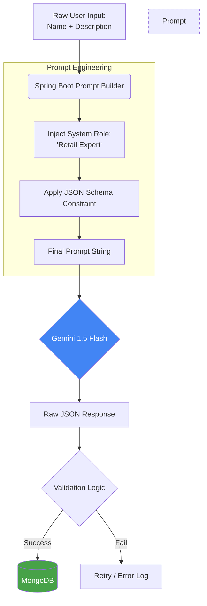

# 🚀 AI Auto-Category & Tag Generator

A full-stack application that uses **Google Gemini AI** to automatically analyze product names and descriptions, generate high-quality categories and SEO tags, and store them in **MongoDB**.

---

## 🏗️ System Architecture Overview

This flowchart illustrates how the Spring Boot backend acts as an orchestrator between the React frontend, the Gemini AI engine, and the MongoDB database.

```mermaid
graph LR
  A[React Frontend] -->|1. POST Name/Desc| B(Spring Boot Backend)
  B -->|2. Structured Prompt| C{Gemini AI}
  C -->|3. JSON Response| B
  B -->|4. Save Product| D[(MongoDB)]
  D -->|5. Success| B
  B -->|6. Return Saved Data| A

  style C fill:#4285F4,stroke:#333,stroke-width:2px,color:#fff
  style D fill:#47A248,stroke:#333,stroke-width:2px,color:#fff
  style B fill:#6DB33F,stroke:#333,stroke-width:2px,color:#fff
  ```

## 🕒 Data Flow Sequence
The step-by-step communication process for generating AI metadata:

```mermaid
sequenceDiagram
    autonumber
    participant R as React Frontend
    participant S as Spring Boot
    participant G as Gemini AI
    participant M as MongoDB

    R->>S: POST /api/products/generate
    Note over S,G: Backend wraps data in JSON-strict prompt
    S->>G: Request AI Categorization
    G-->>S: Returns JSON {category, tags}
    S->>M: Save Product Object to 'products' collection
    M-->>S: Confirmation (Object ID)
    S-->>R: Returns Stored Product with AI Tags
```


 🧠 AI Prompt Design Flow 



🛠️ Technologies Used 
Frontend: React.js, Fetch API, CSS3

Backend: Spring Boot 3.4.3, Spring AI

Database: MongoDB (Database: AI_product, Collection: products)

AI Engine: Google Gemini 1.5 Flash