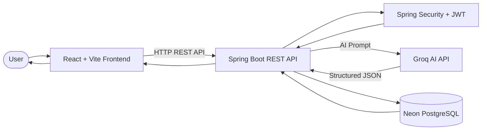
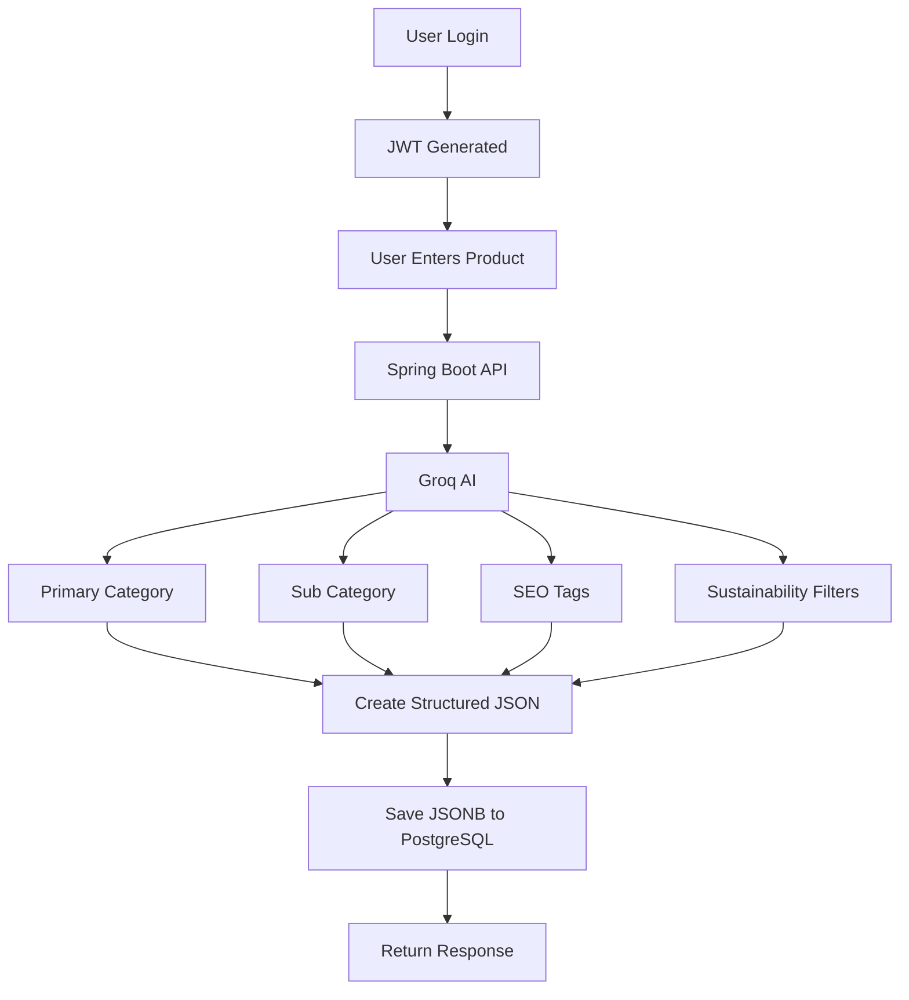
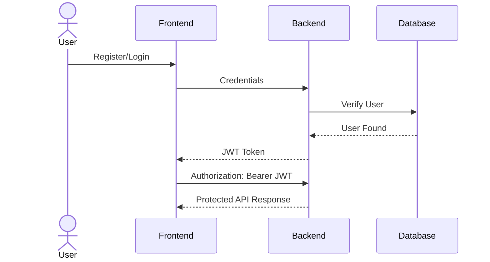
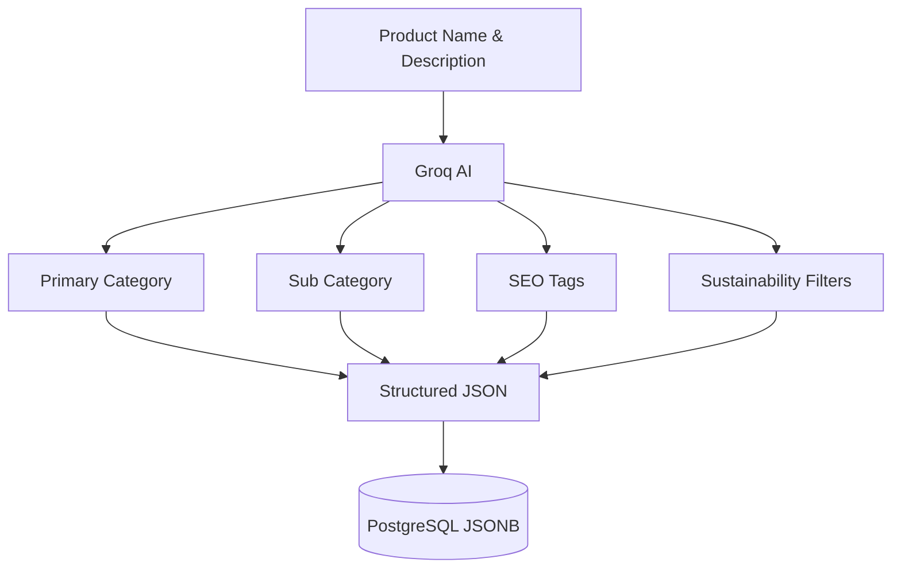
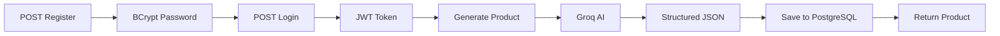

# 🚀 AI Auto-Category & Tag Generator

<div align="center">


### 🤖 AI-Powered Catalog Automation Platform

Automatically classify products, generate SEO tags, recommend sustainability filters, and store structured AI-generated metadata securely.

</div>

---

# ✨ Features

- 🔐 JWT Authentication (Register & Login)
- 🛡️ Protected REST APIs using Bearer Token
- 🤖 AI-powered Product Categorization
- 📂 Automatic Primary Category Detection
- 📑 Smart Sub-Category Suggestions
- 🏷️ AI Generated SEO Tags (5-10)
- 🌱 Sustainability Filter Recommendations
- 🗄️ JSONB Storage in Neon PostgreSQL
- 📖 Swagger API Documentation
- 🐳 Docker Support
- ☁️ Render Deployment Ready

---

# 🏗️ System Architecture


---

# ⚙️ Tech Stack

| Category | Technologies |
|-----------|-------------|
| Backend | Spring Boot 3, Spring Security 6, Spring Data JPA, Hibernate |
| Frontend | React, Vite |
| AI | Groq Chat Completions API |
| Database | Neon PostgreSQL (JSONB) |
| Authentication | JWT |
| API Docs | Swagger / Springdoc OpenAPI |
| Deployment | Docker, Render |

---

# 📊 Project Workflow



---

# 🔐 Authentication Flow



---

# 🤖 AI Processing Flow



---

# 📂 Project Structure

```text
AI-Auto-Category-Tag-Generator
│
├── backend
│   ├── controller
│   ├── security
│   ├── service
│   ├── repository
│   ├── entity
│   ├── dto
│   ├── config
│   ├── resources
│   └── Dockerfile
│
├── frontend
│   ├── src
│   │   ├── pages
│   │   ├── components
│   │   ├── services
│   │   └── App.jsx
│   └── Dockerfile
│
├── docker-compose.yml
└── README.md
```

---

# 🔑 Environment Variables

## Backend

```env
SPRING_DATASOURCE_URL=jdbc:postgresql://your-neon-host/neondb?sslmode=require&channelBinding=require
SPRING_DATASOURCE_USERNAME=your_neon_username
SPRING_DATASOURCE_PASSWORD=your_neon_password

GROQ_API_KEY=your_groq_api_key
GROQ_MODEL=llama-3.1-8b-instant

JWT_SECRET=replace_with_a_32_plus_character_secret
JWT_EXPIRATION_MS=86400000

APP_CORS_ALLOWED_ORIGINS=http://localhost:5173

PORT=8081
```

---

## Frontend

```env
VITE_API_URL=http://localhost:8081
```

---

# 🚀 Local Development

## Backend

```bash
cd backend
./mvnw spring-boot:run
```

---

## Frontend

```bash
cd frontend

npm install

npm run dev
```

---

## Open in Browser

Frontend

```
http://localhost:5173
```

Swagger UI

```
http://localhost:8081/swagger-ui.html
```

---

# 🐳 Docker

```bash
docker compose up --build
```

---

# 📡 API Flow



---

# 📌 API Endpoints

| Method | Endpoint | Description |
|---------|----------|-------------|
| POST | `/api/auth/register` | Register User |
| POST | `/api/auth/login` | Login & Get JWT |
| POST | `/api/products/generate-and-save` | Generate AI Metadata |

---

# 🎯 Example AI Response

```json
{
  "category": "Home & Kitchen",
  "subcategory": "Reusable Bottles",
  "seoTags": [
    "Eco Friendly",
    "Reusable",
    "Water Bottle",
    "Leak Proof",
    "Stainless Steel"
  ],
  "sustainabilityFilters": [
    "Plastic Free",
    "Recycled",
    "Reusable"
  ]
}
```

---

# ⭐ Future Improvements

- 📷 Image-based Product Categorization
- 🌍 Multi-language Support
- 📊 Analytics Dashboard
- 🔍 Semantic Product Search
- 📦 Batch Product Processing
- 🤖 Multiple AI Model Support

---

# 👨‍💻 Author

**Amrita Pandey**

Java Full Stack Developer • AI/ML Enthusiast

---

<div align="center">

### ⭐ If you found this project useful, consider giving it a Star ⭐

Made with ❤️ using Spring Boot, React, Groq AI & PostgreSQL

</div>